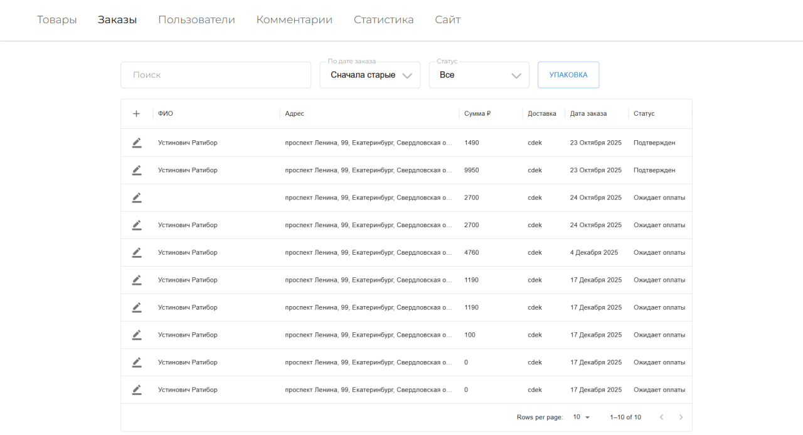
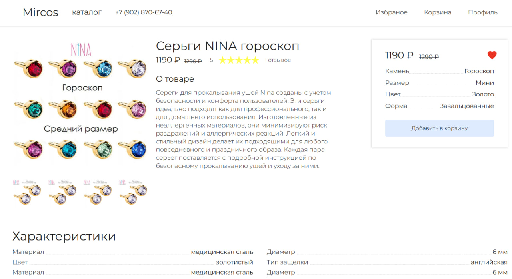

# Интернет-магазин товаров для косметологии

## Описание проекта

Этот проект представляет собой интернет-магазин, созданный для продажи товаров в области косметологии. Он обеспечивает удобный и интуитивно понятный интерфейс для пользователей, позволяя им легко находить и заказывать косметические продукты. Данный репозиторий содержит Frontend часть проекта, Backend находится по ссылке: <https://github.com/ratiborU/m-backend>

## Технологии

Проект реализован с использованием следующих технологий:

- HTML, CSS, JavaScript/TypeScript
- Next.js фреймворк на базе React
- MUI для панели администратора
- Другие библиотеки в файле package.json

## Архитектура

- /src - корневая папка
- /app - папка со страницами
  - /admin - страницы панели администратора
    - /persons - управление пользователями
    - /products - управление товарами
    - /orders - управление заказами
    - /comments - управление комментариями
    - /statistics - страница статистики
  - /login - страница входа
  - /signig - страница регистрации
  - /catalog - страница каталога
  - /favorite - страница избранного
  - /cart - страница корзины
  - /order - страница оформления заказа
  - /product - страница товара
  - /profile  - страница профиля
- /components - папка с компонентами
  - /UI - компоненты кнопок инпутов и др.
- /hooks - кастомные хуки
- /lib - вспомогательные функции
- /providers - контекст провайдеры
- /services - запросы по API к серверу
- /widjets - виджеты

## Реализованные Функции

- Регистрация и аутентификация пользователей
- Просмотр каталога товаров с возможностью фильтрации и сортировки
- Добавление товаров в избранное, корзину и оформление заказа
- Рекомендация товаров
- Интеграция с платежной системой
- Интеграция с YandexMaps
- Адаптивный дизайн
- Панель администратора со статистикой

## Демо

Демонстрация основных страниц

<!--  -->

### Страница товара



### Панель администратора


## Установка и запуск

### Требования

- Node.js v22.21.0
- npm 10.9.4
- Next.js 14.2.14
- MUI 6.1.3

### Шаги

``` bash
# Клонируйте репозиторий
git clone https://github.com/ratiborU/m-frontend

# Установите зависимости
npm i

# Создайте файл .env в корневой папке со следующим содержимым
BACKEND_URL=http://localhost:5000/api

# Запустите проект и перейдите по ссылке http://localhost:3000
npm run dev
```
